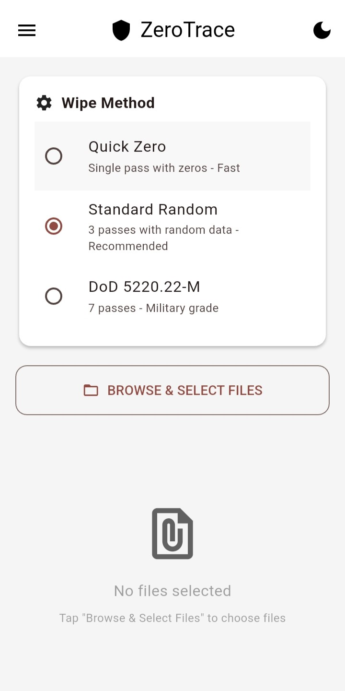
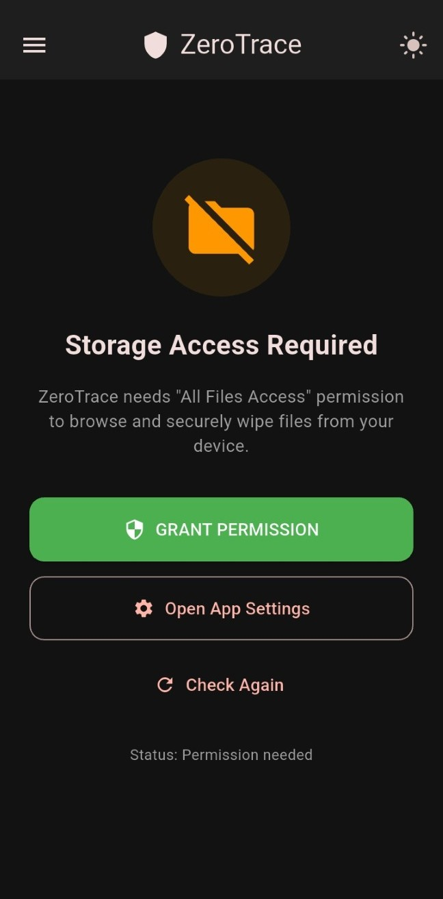
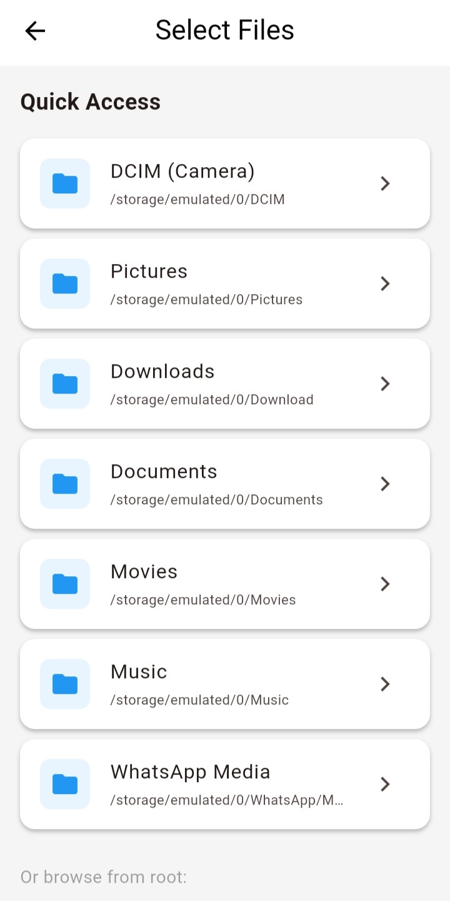
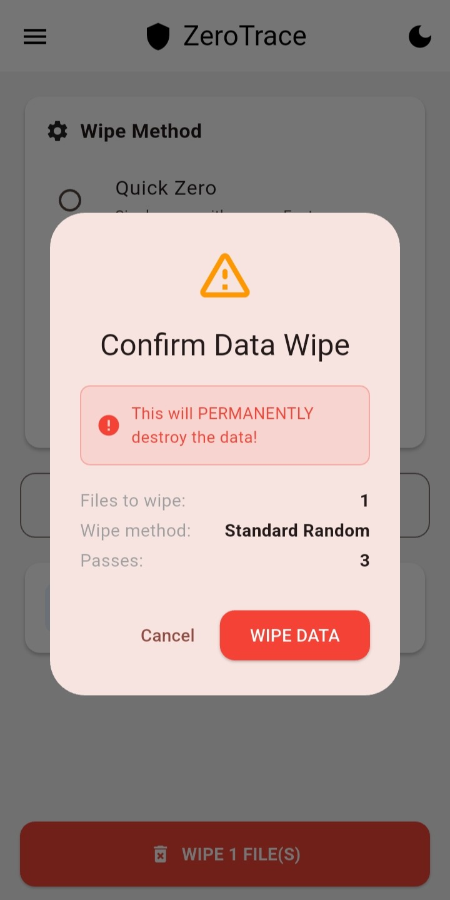
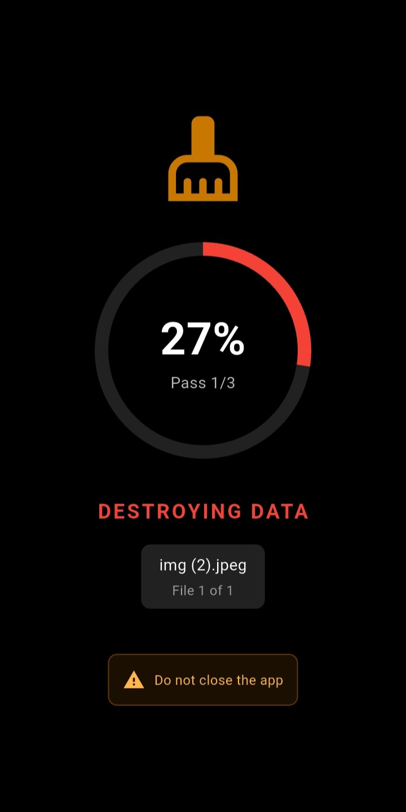
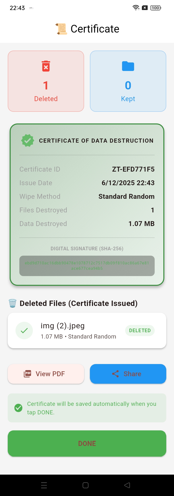
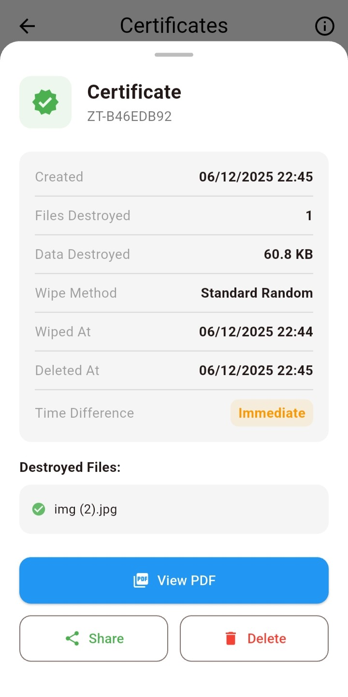
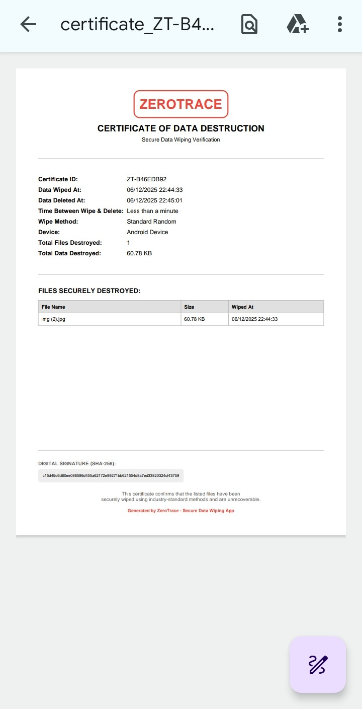

# 🔐 ZeroTrace -- Secure File Wiping App

<div align="center">


**A privacy-first, secure data destruction app built with Flutter that
makes deleted files unrecoverable.**

[Features](#features) • [Installation](#installation) •
[Screenshots](#screenshots) • [Dependencies](#dependencies)

</div>

------------------------------------------------------------------------

## 📋 Table of Contents

-   [About](#about)
-   [Features](#features)
-   [Direct Download Link](#direct-download-link)
-   [Installation](#installation)
    -   [Prerequisites](#prerequisites)
    -   [Setup](#setup)
    -   [Running the App](#running-the-app)
-   [How It Works](#how-it-works)
    -   [Architecture](#architecture)
    -   [Data Storage](#data-storage)
    -   [Counter Types](#counter-types)
-   [Dependencies](#dependencies)
-   [Screenshots](#screenshots)
-   [Project Structure](#project-structure)
-   [Future Enhancements](#future-enhancements)
-   [Contributing](#contributing)

------------------------------------------------------------------------


<br>

## About

ZeroTrace is a secure data-wiping Android app built with Flutter. It
ensures permanently unrecoverable deletion of files by overwriting their
content with zeros or cryptographically secure random data. Users can
wipe sensitive files before selling, recycling, or handing over their
devices, ensuring complete privacy and erasure of their personal data.

<br>

## Features

-   🔐 **Secure Data Wiping:** Zero, Random, or DoD 7‑pass secure
    overwrite methods.
    
-   📁 **File Browser:** Browse and select files directly from device
    storage.

-   🧪 **Post‑Wipe Verification:** View hex‑level corrupted byte
    output.

-   🗑️ **Safe Deletion:** Option to delete wiped files or keep them for
    verification.

-   📄 **PDF Certificate Generation:** Includes filenames, sizes, wipe
    method, timestamp, and SHA‑256 digital signature.

-   📤 **Shareable Certificates:** Export via WhatsApp, email, or other
    apps.

-   🔒 **Fully Offline:** No data leaves the device---complete privacy
    guaranteed.

<br>

## Direct Download Link

The app's latest .apk file can be downloaded form the below link,

Download: [ZeroTrace.apk](https://github.com/omhujband/ZeroTrace/releases/download/v2.1.0/ZeroTrace.apk)

<br>

## Installation

Clone the repository and run on any Flutter-supported Android
environment.

``` bash
git clone https://github.com/omhujband/ZeroTrace.git
cd zerotrace
# get all the dependencies 
flutter pub get
# run the app
flutter run
```

<br>

## Prerequisites

-   Flutter SDK (\>=3.x recommended)
-   Android SDK + emulator or physical device
-   Dart SDK (included with Flutter)
-   Required storage permissions on device

<br>

## Setup

1.  Install Flutter & set up the environment.

2.  Enable USB debugging (for physical devices).

3.  Connect device or start emulator.

4.  Fetch dependencies using:

``` bash
flutter pub get
```

<br>

## Running the App

To build and run:

``` bash
flutter run
```

To build a release APK:

``` bash
flutter build apk --release
```

<br>

## How It Works

1.  User selects a file.

2.  The file's raw bytes are overwritten with chosen wipe pattern:
    -   **Quick Zero:** Single pass of zero bytes.

    -   **Standard Random:** 3 passes with cryptographically secure
        random data.

    -   **DoD 7‑Pass:** Military‑grade 7‑layer overwrite, where the first pass is zeros, second pass is 1's, and third to seventh pass is random bit pattern.

3.  User can verify corruption by viewing hex output.

4.  User may delete the wiped file entirely.

5.  ZeroTrace generates a **tamper‑proof PDF certificate** summarizing
    the wipe operation.

<br>

## Architecture

-   **Flutter UI Layer:** Material + custom widgets.

-   **Platform Channels:** Bridge to Android for secure byte-level
    overwrite.

-   **Wipe Engine:** Kotlin/Android code performing secure overwrites.

-   **PDF Generator:** Flutter + native utilities exporting
    certificates.

-   **Local Storage / File APIs:** Access and modify device filesystem.

<br>

## Data Storage

-   No cloud storage.

-   Only local temporary buffers used during overwrite.

-   Certificates stored locally until user exports/shares them.

<br>

## Counter Types

Used to count wipe passes: - **Single-pass counter** - **Triple-pass counter** - **7-pass DoD counter**

Used internally for tracking overwrite progress & certificate logging.

<br>

## Dependencies

```yaml
dependencies:
  flutter:
    sdk: flutter
  file_picker: ^8.0.0+1        
  permission_handler: ^11.3.1   
  pdf: ^3.10.8
  path_provider: ^2.1.3
  share_plus: ^9.0.0           
  open_file: ^3.3.2
  crypto: ^3.0.3
  uuid: ^4.4.0
  intl: ^0.19.0                 
  shared_preferences: ^2.2.3
  cupertino_icons: ^1.0.6


dev_dependencies:
  flutter_test:
    sdk: flutter
  flutter_lints: ^4.0.0
```

<br>

## Screenshots

### Screens 

<div align="center">

| Home Screen | Dark Mode | File Selection |
|-------------|-------------|-----------------|
|  |  |  |

</div>

<br>

<div align="center">

| Wiping Files | Destroying Data | Certificate Generation |
|-------------|-------------|-----------------|
|  |  |  |

</div>

<br>

<div align="center">

| Certificate Details | Certificate PDF | 
|-------------|-------------|
|  |  |

</div>

<br>

## Project Structure

```
├─ assets/
│  ├─ icon/
│  │  └─ app_icon.png                 # App launcher icon
│  └─ howto/                       
│     └─ (other guide screenshots…)
│
├─ lib/
│  ├─ main.dart                       
│  │
│  ├─ config/
│  │  └─ app_themes.dart              # Light/Dark theme definitions
│  │
│  ├─ providers/
│  │  └─ theme_provider.dart          # ThemeMode state management
│  │
│  ├─ models/
│  │  ├─ certificate.dart             # WipeCertificate & WipeResultSummary
│  │  ├─ certificate_record.dart      # Stored certificate metadata (history)
│  │  ├─ wipe_result.dart             # WipeResult & WipeMethod definitions
│  │  └─ wiped_file.dart              # WipedFile model (wiped but not deleted)
│  │
│  ├─ services/
│  │  ├─ certificate_service.dart         # Generate/save certificates (PDF)
│  │  ├─ certificate_storage_service.dart # Persist & securely delete certificates
│  │  ├─ storage_service.dart             # Store/load wiped file records
│  │  ├─ theme_service.dart               # Persist ThemeMode in SharedPreferences
│  │  └─ wipe_service.dart                # Core secure wiping logic (files)
│  │
│  └─ screens/
│     ├─ home_screen.dart             # Main UI, wipe method selection, drawer
│     ├─ file_browser_screen.dart     # Custom file browser for selecting files
│     ├─ wipe_progress_screen.dart    # “Destroying data” progress UI
│     ├─ verification_screen.dart     # Show that data is corrupted (hex/raw)
│     ├─ decision_screen.dart         # Delete or keep wiped files
│     ├─ wiped_files_screen.dart      # Manage wiped-but-kept files
│     ├─ certificates_screen.dart     # Certificates list, view/share/delete
│     └─ how_to_use_screen.dart       # Multi-step How To Use guide with tabs

```

<br>

## Future Enhancements

-   Full‑drive wiping (internal + SD card)

-   Analytics dashboard (on‑device only)

-   Encrypted wipe certificates

-   Entire folders wiping

-   AI-based file sensitivity detection (all offline)


<br>

## Contributing

Contributions, issues, and feature requests are welcome!

1.  Fork the repository

2.  Create a branch: `git checkout -b feature-name`

3.  Commit changes: `git commit -m "Added feature"`

4.  Push: `git push origin feature-name`

5.  Open a pull request

<br>


## Show Your Support

Give a ⭐️ if this project helped you!


---

<div align="center">

**Made with ❤️ and Flutter**


</div>